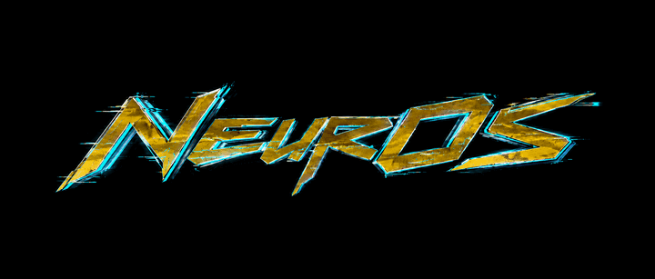

# `crash@nsd:~$ ./neuros`



```text
[ NSD / HARDWARE & ARCHITECTURE ]

project       : NeurOS
architecture  : x86_64 / Intel / AMD
interface     : UEFI / GNU-EFI
assignment    : get Arch running
clearance     : firmware gave us a pointer
warranty      : ask the motherboard
```

**Thanks to Neuro for the DWM setup. This one starts before the window manager gets a vote.**

NeurOS boots Linux from a FAT32 EFI System Partition mounted at `/boot`. With Secure Boot off, it can load the kernel and initramfs itself, build the boot parameters and page tables, call `ExitBootServices`, and hand the machine to Linux. With Secure Boot on, it launches the Arch Unified Kernel Image (UKI) through firmware signature verification.

Before that: 2.9 seconds of gold fragments, cyan tearing, and a logo on black. Then the kernel gets the registers and whatever problems come with them.

### `crash@nsd:~$ make it_boot`

Run these from the repository root on Arch:

```sh
sudo pacman -S --needed base-devel linux-api-headers gnu-efi qemu-system-x86 qemu-ui-gtk edk2-ovmf
make
make test
make run QEMU="qemu-system-x86_64 -display gtk"
```

That builds the loader, runs native checks and five isolated QEMU boot cases, then opens the splash. With no kernel or UKI staged, the preview lands in recovery. Nothing is broken. You gave it a bootloader and no operating system.

For a UKI you already built for the VM:

```sh
make stage-uki UKI=/path/to/arch-linux.efi
make run QEMU="qemu-system-x86_64 -display gtk"
```

Your host root partition does not magically appear inside QEMU. A full distro boot needs a VM-compatible UKI and a root disk attached separately.

For the complete walkthrough—kernel test, serial output, real installation, updates, and recovery—read [the production field manual](docs/PRODUCTION.md).

### `crash@nsd:~$ interrogate kernel`

```sh
make test-linux KERNEL=/path/to/vmlinuz
```

This builds a static test `/init` and a newc initramfs, then boots the supplied kernel in a disposable QEMU ESP. The useful evidence looks like this:

```text
NEUROS: direct Linux init reached
NEUROS: initramfs and command line verified
```

That means the test reached PID 1 and verified the command line and initramfs. It does not mean your actual root filesystem has booted. The test also checks EFI/ACPI tables, memory-map growth, stale exit keys, versioned boot sets, and recovery from damaged boot data. The kernel needs built-in initramfs, ELF, procfs, sysfs, EFI, ACPI, and serial-console support. Logs live in `build/test-logs/`.

To stage your own kernel inputs in the **VM's** ESP:

```sh
make stage-linux KERNEL=/path/to/vmlinuz CMDLINE=/path/to/cmdline.txt INITRD=/path/to/initramfs.img
make run QEMU="qemu-system-x86_64 -display gtk"
```

`stage-linux` creates legacy boot files and refuses to overwrite existing ones. For repeatable updates, use `make update-linux KERNEL=... CMDLINE=... INITRD=...`. It publishes a complete `set-*` directory, selects it through `boot.conf`, and retains the previous selection. The command line is one ASCII line; the initramfs must match the kernel. If microcode is separate, put it before the main initramfs in the combined archive. Linux unpacks the buffer.

All test runners are C. `make check-tools` exercises native tools and interrupted updates. `make test-secureboot KERNEL=...` checks real firmware signature enforcement using OpenSSL, GNU objcopy, systemd-sbsign, and QEMU/OVMF. The [field manual](docs/PRODUCTION.md#release-validation) has the full matrix.

### `crash@nsd:~$ cat recovery.keys`

During the splash, **Enter** or **Esc** skips the animation after a short input guard. **M** opens recovery before the kernel launches. The logo stays until handoff; Linux owns the display after that. A graphics failure shows its status for two seconds before continuing.

| Recovery key | What the machine does |
|---|---|
| Enter | Retry the default boot path |
| P | Boot the previous direct Linux set once |
| U | Boot the current UKI |
| B | Boot the previous UKI |
| R | Open systemd-boot |
| Esc | Return to the caller |

Secure Boot denies direct Linux boot, including **P**. Current and previous UKIs still have to pass firmware verification. A kernel panic after handoff needs a reset; the bootloader cannot drag a running kernel back by its collar.

### `crash@nsd:~$ cat hardware.contract`

The direct loader follows `EFI/NeurOS/boot.conf` when present. Each versioned set requires `vmlinuz`, `cmdline.txt`, and `initrd`. Without a configuration, it reads the legacy files under `EFI/NeurOS/`; the legacy initrd is optional. With no direct set, it uses `EFI/Linux/arch-linux.efi`. A configured but broken kernel or selection goes to recovery. **U** lets you explicitly choose the UKI.

```text
direct kernel       : relocatable x86-64 bzImage / boot protocol 2.12+
firmware paging     : four levels
boot allocations    : below 4 GiB
kernel file         : up to 128 MiB
decompression space : up to 512 MiB
initramfs           : up to 512 MiB
command line        : up to 4095 bytes, or the kernel's smaller limit
EFI memory map      : grows up to 4 MiB
E820 overflow       : Linux extension records
```

Raw ELF kernels, five-level firmware paging, and confidential-computing guests are outside this backend. Root filesystem encryption belongs to the distro's initramfs. CPU memory encryption is a separate problem.

NeurOS preserves the current graphics mode and passes standard RGB/BGR or valid packed 16/24/32-bit GOP bitmask information to Linux. Firmware-only blit modes keep the splash but do not advertise a Linux framebuffer.

After the first `ExitBootServices` attempt, returning to firmware recovery is unsafe. Stale map keys get retried using memory services; an unrecoverable exit failure halts until reset. Firmware has rules. Unfortunately, some of them matter.

### `crash@nsd:~$ deploy --to metal`

The installer expects a working systemd-boot setup, an Arch UKI at `/boot/EFI/Linux/arch-linux.efi`, and a FAT32 ESP mounted at `/boot`. It adds NeurOS to the existing menu. Keep the working Arch entry and a rescue USB.

With Secure Boot **disabled**, first installation is:

```sh
make test package
sudo ./build/neuros-install --esp /boot
```

Already installed an older build? Use the update path:

```sh
make package
sudo ./build/neuros-install --esp /boot --update
```

The installer preserves boot order and defaults. An update validates a staged copy, preserves the menu entry, and saves the old executable as `/boot/EFI/NeurOS/neuros.efi.previous`. Each update replaces that backup. Restoring it is manual; there is no automatic executable fallback.

With Secure Boot **enabled**, build `package-signed SIGN_KEY=... SIGN_CERT=...` and add `--signed` to the installer command. Your certificate must already be trusted by firmware. NeurOS, systemd-boot, and the UKI all need trusted signatures. The installer checks signature containers; firmware checks authenticity and revocation. Nothing here enrolls host keys for you.

Packaging installs the EFI executable and menu entry. Direct kernels and initramfs images need separate staging. Follow [the field manual](docs/PRODUCTION.md#install-on-the-actual-machine) before changing your real boot setup.

### `crash@nsd:~$ cat sources`

[QUICK_REF.md](QUICK_REF.md). Short titles. Actual sources. Read what the firmware signed you up for.

```text
[ NSD INTERNAL NOTICE ]

QEMU booted it.
Your motherboard has not submitted its opinion yet.
```
